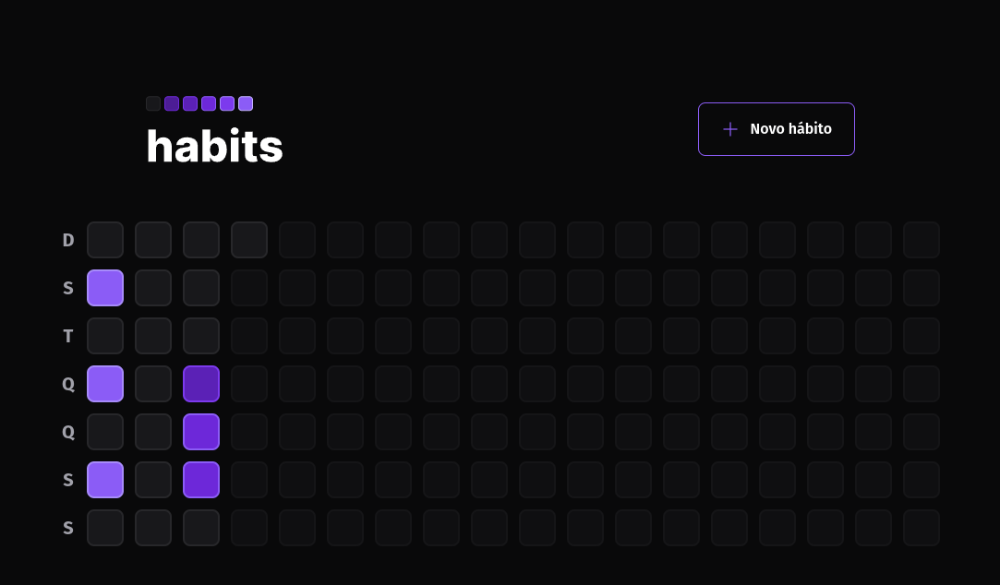
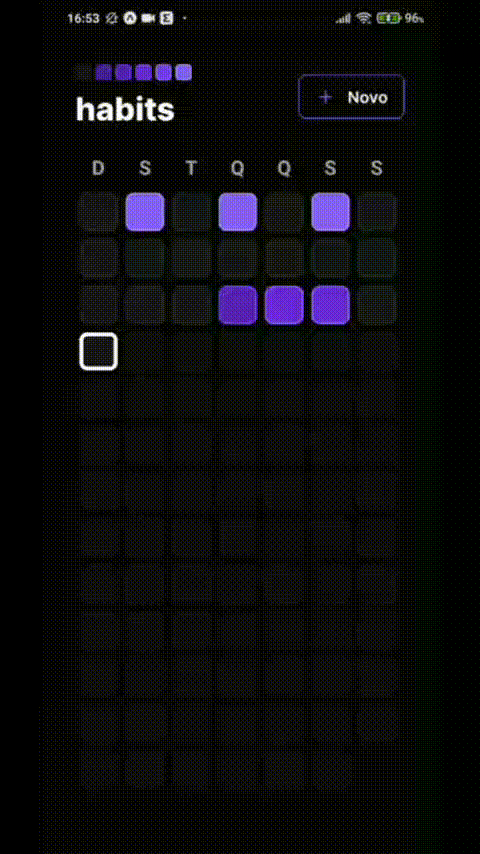

<h1 align="center"> Habits </h1>

<p align="center">
  Habits is an app that you can add some habits to track and check if you completed them.<br/>
</p>

<p align="center">
  <a href="#-technologies">Technologies</a>&nbsp;&nbsp;&nbsp;|&nbsp;&nbsp;&nbsp;
  <a href="#-project">Project</a>&nbsp;&nbsp;&nbsp;|&nbsp;&nbsp;&nbsp;
  <a href="#-how-to-use">How to Use</a>&nbsp;&nbsp;&nbsp;|&nbsp;&nbsp;&nbsp;
  <a href="#-license">License</a>
</p>

<p align="center">
  
</p>

<br>

<p align="center">
  
</p>

<br>

<p align="center">
  
</p>

## 💻 Project

Habits is an app that you can use to track your habits and check if you completed them. It was developed during the NLW Setup Week.

## 🚀 Technologies

This project was developed using the follow technologies:

### Server:
  - NodeJS.
  - Prisma
  - Typescript
  - Fastify
  - Zod

### Web
  - ReactJS
  - Tailwindcss
  - Typescript
  - Vite

### Mobile
  - React Native
  - Expo
  - Tailwindcss/Nativewind

## 🛠️ How to Use
It's necessary to have NodeJS and Expo installed on your pc. Follow the official instructions based on your [Operating System](https://nodejs.org/en/download/package-manager/) to install NodeJS if you don't have already installed.
Clone this repo with the following command:

```bash
git clone https://github.com/rafael-gomes/habits.git
```
After clone, create a *.env* file inside the *server* folder with the content of the *.env.example* file. Then, you need to install the dependencies on server, web and mobile. To do, follow the below commands:
```bash
cd web
npm install
cd ../mobile
npm install
cd ../server
npm install
```

After all dependencies installed, you need to start the server. Inside the *server* folder, execute:

```bash
npm run dev
```
- Optionally you can run *npx prisma db seed* to delete and seed the database with some example habits.

With the server running, you can run the web app with the command inside the *web* folder:

```bash
npm run dev
```

With the server running, you can run the mobile app with the command inside the *mobile* folder:

```bash
npx expo start
```

Then you can open expo on your mobile phone to scan the QR code or open in an Emulator

## 📝 License

This project is under MIT License